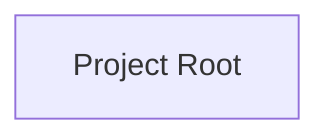
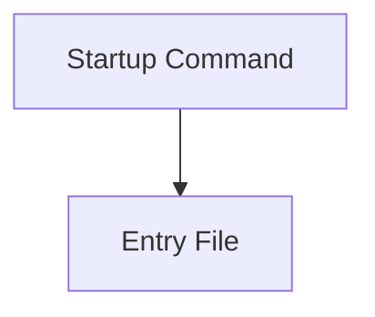
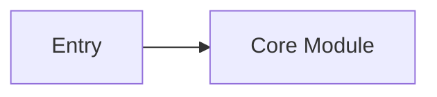
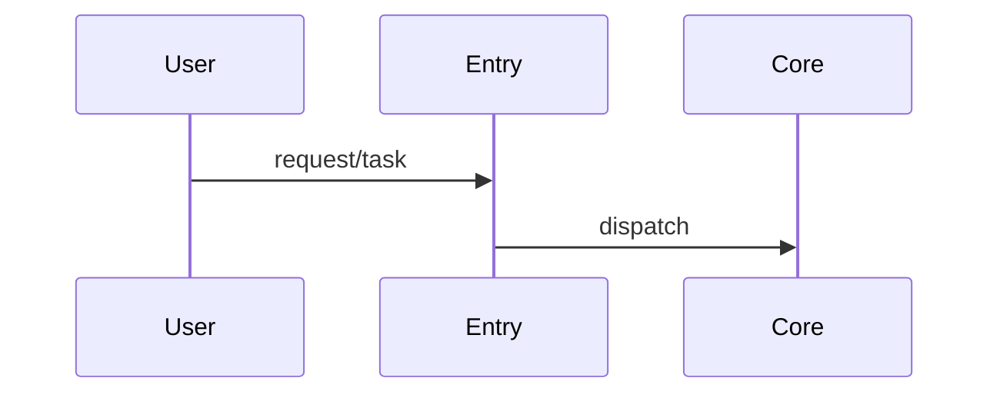
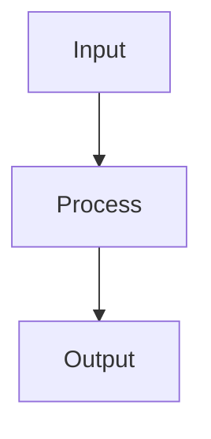
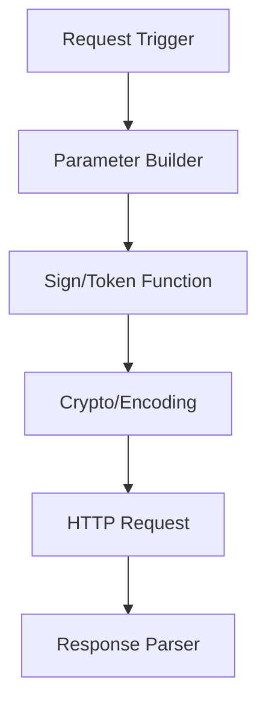

# Project Memory Map 898

## Overview

Build a reusable memory map for a project by inspecting only the user-approved project scope, identifying how the system is structured and how it runs, then producing concise documentation and diagrams that future Codex sessions can reuse.

Core principle: document verified facts separately from static inferences and unknowns.

## Scope Rules

- Analyze only the directory or files the user explicitly provides.
- Do not scan whole drives or unrelated parent directories.
- Do not upload, publish, or expose sensitive files.
- Treat secrets as sensitive even when found locally: `.env`, credentials, cookies, tokens, private keys, database URLs, proxy credentials, session dumps, and captured traffic.
- Record that a sensitive file or variable exists, but redact values.
- Prefer `rg`, `rg --files`, package manifests, config files, and entry files over broad recursive listing.
- Exclude generated or heavy directories unless the user explicitly asks: `.git`, `node_modules`, `dist`, `build`, `.next`, `.nuxt`, `target`, `vendor`, `__pycache__`, `.pytest_cache`, `.mypy_cache`, `.venv`, `venv`, `env`, `logs`, `tmp`, `.idea`, `.vscode`.

## Quick Reference

| Task | Evidence to gather | Output |
|---|---|---|
| Project identity | README, package manifests, pyproject, requirements, lockfiles | One-sentence purpose and tech stack |
| Entry points | main files, scripts, CLI commands, Docker files, service configs | Startup flow diagram |
| Structure | top-level dirs, core modules, tests, configs | Project structure map |
| Dependencies | imports, manifests, framework configs | Module dependency map |
| Runtime flow | routers, tasks, workers, schedulers, middleware | Request/task flow diagram |
| Data flow | DB clients, file I/O, queues, cache, network clients | Data flow diagram |
| Reverse/crawler flow | signing, encryption, token, request replay, browser automation | Reverse workflow map |
| Risk and unknowns | missing env, dynamic imports, external services | Open questions and confidence notes |

## Workflow

1. Confirm the analysis root and output target. If no output target is given, use `PROJECT_MEMORY.md` in the project root.
2. Inventory the project with narrow commands. Start with manifests and root files before reading implementation files.
3. Identify the project type and runtime:
   - Python: `pyproject.toml`, `requirements*.txt`, `setup.py`, `setup.cfg`, `Pipfile`, `poetry.lock`, `uv.lock`, `main.py`, `app.py`, `manage.py`.
   - Node or frontend: `package.json`, lockfiles, `vite.config.*`, `next.config.*`, `nuxt.config.*`, `src/main.*`, `src/App.*`.
   - Services: `Dockerfile`, `docker-compose*.yml`, `.github/workflows`, systemd files, Procfile.
   - Crawler or reverse engineering: request clients, browser automation, CryptoJS/WebCrypto/Node crypto, sign/token/encrypt/decrypt functions, captured request builders.
4. Read only the files needed to answer the map. Prefer small representative files over every file in a directory.
5. Build a fact table while analyzing:
   - `Verified`: directly observed in files or command output.
   - `Inferred`: likely from naming, imports, or framework conventions.
   - `Unknown`: important but not present or not safely readable.
6. Generate diagrams after the facts are clear. Split large graphs into smaller Mermaid diagrams instead of one unreadable graph.
7. Reverse-verify the result before completion:
   - Every important claim has a source file, command output, or clear inference label.
   - Mermaid syntax is simple enough to render.
   - Sensitive values are redacted.
   - The document explains what to inspect next when confidence is low.

## Output Contract

When asked to generate project memory, produce a Markdown document with these sections unless the user requests a different format:

````markdown
# Project Memory

## 1. Summary

- Purpose:
- Project type:
- Primary language/runtime:
- Main entry point:
- Confidence:

## 2. Tech Stack

| Area | Evidence | Notes |
|---|---|---|

## 3. Project Structure



| Path | Role | Evidence Level |
|---|---|---|

## 4. Entry Points And Startup Flow



## 5. Core Modules

| Module | Path | Responsibility | Key Dependencies | Evidence Level |
|---|---|---|---|---|

## 6. Module Dependency Map



## 7. Runtime Or Request Flow



## 8. Data Flow And External Dependencies



| Dependency | Type | Used By | Sensitive Data? | Evidence |
|---|---|---|---|---|

## 9. Configuration And Secrets

| Config | Source | Purpose | Value Handling |
|---|---|---|---|

## 10. Reverse/Crawler Notes

Use this section only when applicable.

| Item | Location | Role | Evidence Level |
|---|---|---|---|

## 11. Verified Facts

- Fact:
  Evidence:

## 12. Inferences

- Inference:
  Reason:
  Confidence:

## 13. Unknowns And Next Checks

- Unknown:
  Why it matters:
  Suggested check:
````

If the user requests machine-readable memory, also produce `project-memory.json`:

```json
{
  "project": {
    "name": "",
    "purpose": "",
    "root": "",
    "type": "",
    "confidence": "low|medium|high"
  },
  "entry_points": [],
  "modules": [],
  "dependencies": [],
  "flows": [],
  "configs": [],
  "sensitive_items_redacted": [],
  "verified_facts": [],
  "inferences": [],
  "unknowns": []
}
```

## Reverse And Crawler Projects

For crawler, JavaScript reverse analysis, signing, encryption, anti-debugging, Electron, browser automation, or request replay projects, include an extra map:



Capture these items when present:

- target endpoints and request methods, without exposing credentials
- parameter generation order
- timestamp, nonce, device, fingerprint, cookie, or token dependencies
- hash, HMAC, AES, RSA, DES, SM2, SM3, SM4, Base64, URL encoding, or custom codec usage
- browser automation entry points and anti-debugging handling
- replay requirements and missing runtime state

Use `reverse-analysis-898` as a supporting skill when the task involves JavaScript signing, encryption, token generation, anti-debugging, Electron asar analysis, DevTools blocking, request replay, or browser fingerprint logic.

## Common Mistakes

| Mistake | Fix |
|---|---|
| Scanning outside the approved project | Stop and ask for permission before expanding scope |
| Treating guesses as facts | Label them as inferences with confidence |
| Dumping secrets into docs | Redact values and document only names/purpose |
| Making one huge Mermaid graph | Split by structure, startup, dependency, runtime, and data flow |
| Reading generated directories first | Start from manifests, configs, entry files, and core modules |
| Ignoring tests | Use tests to confirm expected behavior and module boundaries |
| Claiming completeness too early | Run the reverse-verification checklist before final response |

## Final Response

Report:

- Where the memory document was written.
- Which files or commands were used as primary evidence.
- Which claims are inferred or low confidence.
- Whether sensitive data was found and redacted.
- Any verification that was run, or why verification was not possible.
